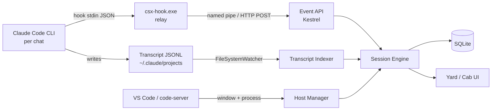
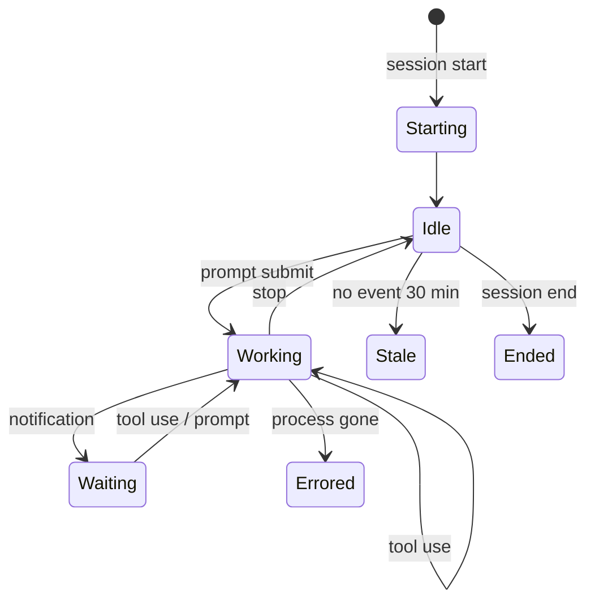

# CodeSwitchX — Design Document

Adapted 2026-09-23 from the "Switchyard — Design Document" (Claude Docs,
`https://claude.ai/code/artifact/ec176559-b110-484b-a4da-1bb087e09bad`). The product is
renamed **CodeSwitchX** and the shell is **WPF** instead of WinUI 3. Everything else
follows the original document; deviations are listed first so they are easy to review.

## Deviations from the Switchyard document

| Topic | Switchyard doc | CodeSwitchX decision | Why |
| --- | --- | --- | --- |
| Product name | Switchyard | CodeSwitchX | Owner decision |
| Shell framework | WinUI 3 (Windows App SDK), MSIX | WPF on .NET 10, unpackaged first | Owner decision; WPF was already the doc's named fallback |
| Project names | Switchyard.App / Core / Hosting / Ingest / Telemetry / Data / Hook / Link / Tests | CodeSwitchX.UI / Core / Hosting / Ingest / Telemetry / Data / Hook / Link, one test project per library | Owner naming convention; per-library tests keep test runs independent |
| Solution file | not specified | `CodeSwitchX.slnx` | Owner decision |
| Relay executable | `sy-hook.exe` | `csx-hook.exe` | Follows the rename |
| Data folder | `%LOCALAPPDATA%\Switchyard\` | `%LOCALAPPDATA%\CodeSwitchX\` | Follows the rename |
| Tray icon | H.NotifyIcon (WinUI) | H.NotifyIcon.Wpf | WPF flavour of the same library |
| Toasts | App SDK notifications | Microsoft.Toolkit.Uwp.Notifications (works for unpackaged WPF) | WPF-compatible; needs the `net10.0-windows10.0.19041.0` TFM when enabled (M2) |
| Hook entry tagging | "tags its entries" | Entries are recognised by the `csx-hook` marker inside the command string | Claude Code rejects unknown fields in hook entries, so no extra JSON keys |
| Event API transport | HTTP and named pipe | Kestrel listens on both a named pipe (preferred) and 127.0.0.1 on a random port; one token guards both | Kestrel supports named pipes natively since .NET 8 |
| Jump hotkeys | Ctrl+Alt+1..9 | Ctrl+Shift+Alt+1..9 (Ctrl+Alt+Y unchanged) | AltGr is reported as Ctrl+Alt, so Ctrl+Alt+digit would swallow AltGr+2/3/7/8/9/0 (² ³ { [ ] }) system-wide on German and other European layouts |
| Chat title | first user prompt, 60 chars | Claude Code's own `summary` line when present, else first user prompt trimmed to 60 chars | The transcript already carries a generated title |

## Overview

CodeSwitchX is a Windows desktop app that hosts many VS Code workspaces, each running one
or more Claude Code CLI sessions, behind a single tile board with live agent status and
token telemetry.

**Problem.** Running several agents across .NET solutions means juggling VS Code windows
with no shared view. It is unclear which chat is working, which is blocked on a permission
prompt, and how much of the usage quota each one burns. The Claude Code desktop app groups
sessions poorly when one workspace has several chats.

**Vision.** A tile per workspace, a status light per chat, one click to dive into a full
VS Code, one hotkey to come back out.

### Goals

- Register, launch and host VS Code workspaces from one app
- Show per-chat status (working, waiting for input, idle, errored) on each tile within 1 second of the change
- Aggregate token usage, cost estimate and quota burn per session, workspace and day
- Leave VS Code and Claude Code unmodified: no forks, no patched binaries
- Windows 10 22H2 and Windows 11, x64 and ARM64

### Non-goals

- Replacing VS Code or building a custom editor
- Driving Claude Code programmatically in v1 (read-only observation plus launch)
- Cloud sync, multi-user or remote hosting in v1
- macOS or Linux

## User experience

The app has two modes: the **Yard** (tile board) and the **Cab** (one workspace
full-window), toggled by a global hotkey, Ctrl+Alt+Y by default.

### The Yard (tile board)

- Responsive grid of tiles, one per registered workspace, grouped by user-defined Tracks (for example "DiffusionNexus", "Client work")
- Each tile shows the workspace name, git branch and dirty-file count, a live thumbnail of the VS Code window, and one status row per Claude Code chat
- Chat rows show a colored dot, the chat title, elapsed time in the current state, and context-window fill as a thin bar
- Tile border pulses amber when any chat is waiting for input; that tile also sorts to the front when "Needs me first" sorting is on
- Right-click menu: open, open in new worktree, reveal in Explorer, open terminal here, pause notifications, unregister

### Registering a workspace

- "Add workspace" accepts a folder, a `.code-workspace` file or a `.sln`/`.slnx` path (the solution's folder becomes the root)
- CodeSwitchX detects the git repo, worktrees, `CLAUDE.md` presence and the .NET solution files
- The user picks a Track, an accent color and an optional VS Code profile
- The workspace is saved; launching is lazy until the tile is first opened, unless "Start with CodeSwitchX" is ticked

### The Cab (working inside a workspace)

- Clicking a tile brings that VS Code to full size inside the CodeSwitchX shell (see VS Code hosting strategy)
- A 28 px strip across the top keeps the other tiles as small status pips, so a waiting agent elsewhere stays visible
- The hotkey, the strip's back arrow or a mouse-back button returns to the Yard; Ctrl+Shift+Alt+1..9 jumps straight to a workspace

### Performance bar

A collapsible bar docked at the bottom of both modes shows, left to right: tokens today,
estimated cost today, 5-hour quota burn, a 60-minute token-rate sparkline, active sessions
count, and machine CPU and RAM with the VS Code share highlighted. Clicking any figure
opens the Telemetry panel with per-session breakdowns.

## System architecture

CodeSwitchX is one WPF process with an in-process Kestrel endpoint (named pipe plus
127.0.0.1), plus a tiny hook relay executable that Claude Code calls on every event.



Claude Code hook events and transcript file changes both feed the Session Engine, which
reconciles them into one state per chat and pushes it to the UI.

| Component | Project | Responsibility |
| --- | --- | --- |
| Shell (WPF) | CodeSwitchX.UI | Yard, Cab, performance bar, tray icon, global hotkeys, toasts |
| Host Manager | CodeSwitchX.Hosting | Launches, tracks, docks and focuses VS Code or code-server instances; maps windows and PIDs to workspaces |
| Event API | CodeSwitchX.Ingest | Local named-pipe and HTTP endpoint receiving hook payloads; token-authenticated |
| csx-hook.exe | CodeSwitchX.Hook | Native AOT relay (under 2 MB, under 20 ms startup) that forwards stdin JSON and exits 0 even if CodeSwitchX is down |
| Transcript Indexer | CodeSwitchX.Ingest | Tails JSONL transcripts incrementally, extracts usage, titles, tools, errors |
| Session Engine | CodeSwitchX.Core | State machine per chat, workspace roll-ups, staleness timeouts, event bus to the UI |
| Telemetry Service | CodeSwitchX.Telemetry | Token and cost aggregation, quota windows, process CPU and RAM sampling |
| Store | CodeSwitchX.Data | EF Core over SQLite: workspaces, sessions, events, usage buckets, settings |

## VS Code hosting strategy

v1 ships **Snap hosting** (real desktop VS Code windows positioned over the Cab area),
with **Web hosting** (code-server in WebView2) as an opt-in per workspace; true Win32
reparenting is rejected.

| Mode | How it works | Pros | Cons |
| --- | --- | --- | --- |
| Snap (default) | Launch `code --new-window <path>`, find its HWND, strip nothing, and keep it sized and z-ordered exactly over the Cab region; hide it (cloak) when returning to the Yard | Full Microsoft marketplace, C# Dev Kit, debugger, zero compatibility risk | Window can escape if user drags it; needs Win32 plumbing for tracking |
| Web (opt-in) | Run `openvscode-server` or `code-server` per workspace on a random localhost port; Cab hosts it in a WebView2 control | Truly embedded, one process tree per workspace, perfect thumbnails | Open VSX marketplace only; C# Dev Kit unavailable; debugger limits |
| Reparent (rejected) | Win32 `SetParent` of the Electron window into the shell | Looks embedded | Focus, IME, DPI and popup-menu bugs; breaks on VS Code updates |

### Snap hosting details

- **Window discovery:** start the process with the user's normal profile (a separate `--user-data-dir` would lose their settings), then match new top-level `Chrome_WidgetWin_1` windows owned by `Code.exe` whose title contains the workspace folder name; confirm through the CodeSwitchX Link extension handshake when the extension is installed
- **Positioning:** `SetWindowPos` on Cab resize and move; a `WinEventHook` on `EVENT_OBJECT_LOCATIONCHANGE` snaps the window back if the user drags it
- **Hiding:** `DwmSetWindowAttribute(DWMWA_CLOAK)` keeps the window alive and fast to restore, and avoids taskbar flicker
- **Thumbnails:** DWM thumbnails (`DwmRegisterThumbnail`) render live, GPU-composited previews on tiles at almost no cost; cloaked windows may not update, so fall back to a last-frame capture taken just before cloaking

### Companion extension (optional, recommended, M3)

A small VS Code extension, "CodeSwitchX Link", connects to the Event API on activation and
reports its workspace folder, window process id and window title changes. It also exposes
commands such as "Back to Yard" and "Mark tile note". This removes all title-parsing
guesswork.

## Agent status detection

Hook events are the authoritative status source; transcript tailing fills gaps and supplies
history, and process liveness catches crashed sessions.

### Hook installation

On first run CodeSwitchX offers to add entries to the user-level `~/.claude/settings.json`
for the `SessionStart`, `UserPromptSubmit`, `PreToolUse`, `PostToolUse`, `Notification`,
`Stop`, `SubagentStop` and `SessionEnd` events. Each entry calls `"<path>\csx-hook.exe" <event>`.
The installer backs up the file, merges rather than overwrites, and recognises its own
entries by the `csx-hook` marker in the command so they can be removed cleanly. Event names
and payload fields must be checked against the current Claude Code hooks documentation
before release; the parser ignores unknown fields and logs unknown events.

### Session state machine



"Waiting" means Claude needs the user (permission prompt or input request) and drives the
amber pulse and the toast. The state machine is a pure function `(state, event) -> state`
so it can be unit-tested exhaustively; an event that is not listed for the current state
leaves the state unchanged and is logged.

### Mapping sessions to workspaces

- Primary key: the hook payload's `session_id`; the payload's `cwd` maps it to a workspace by longest-prefix match against registered roots (worktrees register as child roots). Paths are compared case-insensitively after normalising separators and trailing slashes
- Chat title: Claude Code's transcript `summary` when present, else the first user prompt trimmed to 60 characters; user-renamable
- Liveness: the relay records its parent process chain, so CodeSwitchX can watch the `claude` process and mark the chat Errored if it exits without a session end event

### Fallbacks

If hooks are not installed, the Transcript Indexer infers status from file activity: a write
within the last 5 seconds means Working, a trailing assistant message with a pending tool
call means Waiting (best effort), otherwise Idle. Tiles show a small "inferred" marker in
this mode.

## Token usage and performance telemetry

Token figures come from the usage fields on assistant messages in the transcripts, rolled
into 1-minute buckets; OpenTelemetry export from Claude Code is a v2 alternative feed.

### Token pipeline

- The Transcript Indexer tails each JSONL file from its last byte offset (stored per file), so restarts never rescan
- Each assistant message yields model, input, output, cache-write and cache-read tokens, deduplicated by message id (Claude Code writes one line per content block, all carrying the same message id and usage)
- Usage lands in `UsageBucket` rows keyed by session, model and minute
- The Telemetry Service computes rates, daily totals and rolling 5-hour and 7-day windows

### Cost and quota

- Cost is an estimate from a user-editable pricing table (per model, per million tokens, including cache rates), shipped with defaults and clearly labelled "estimate"
- Subscription users care about quota, not dollars: the bar can show "5-hour window: tokens used" against a user-set soft budget, since CodeSwitchX cannot read the real plan limit reliably
- Context fill per chat = latest input plus cache tokens divided by the model's context size from the pricing table

### Machine metrics

- CPU and working set per process tree, sampled every 2 seconds with `Process` APIs, grouped per workspace (VS Code renderer, extension host, language servers, `claude`, `dotnet` build servers)
- GPU utilization and VRAM from the Windows GPU performance counters, useful when local models share the machine

### Telemetry panel

Opens from the performance bar: per-session token table, per-workspace stacked usage over
the day, top tool calls by count, and an export to CSV.

## Data model and persistence

State lives in one SQLite file at `%LOCALAPPDATA%\CodeSwitchX\codeswitchx.db`, accessed
through EF Core with WAL mode on and migrations applied at startup.

| Entity | Key fields | Notes |
| --- | --- | --- |
| Workspace | Id, Name, RootPath, WorkspaceFile, TrackId, AccentColor, HostMode (Snap/Web), VsCodeProfile, AutoStart | RootPath unique, normalized lowercase |
| Worktree | Id, WorkspaceId, Path, Branch | Child roots for session mapping |
| Track | Id, Name, SortOrder | Tile groups |
| Session | Id (Claude session id), WorkspaceId, Title, State, StartedAt, LastEventAt, TranscriptPath, Model | One row per chat |
| SessionEvent | Id, SessionId, Kind, ToolName, At, PayloadJson | Pruned after 14 days by default |
| UsageBucket | SessionId, Model, MinuteUtc, Input, Output, CacheWrite, CacheRead | Composite key; source of all token figures |
| TranscriptCursor | Path, ByteOffset, LastWriteUtc | Incremental tailing |
| PricingRule | Model, InputPerM, OutputPerM, CacheWritePerM, CacheReadPerM, ContextWindow | User-editable |
| Setting | Key, ValueJson | Hotkeys, budgets, notification rules |

Writes from the event stream go through a single background channel
(`System.Threading.Channels`) that batches inserts every 250 ms, so a burst of tool events
never blocks the UI thread or contends on SQLite locks.

## Original feature ideas

Three flagship features set CodeSwitchX apart from existing session dashboards: Collision
Radar, Build Traffic Control and Loop Detection, all built from signals CodeSwitchX already
collects.

| Feature | What it does | Signal source | Phase |
| --- | --- | --- | --- |
| Collision Radar | Warns when two chats (same repo or shared projects) edit the same file within 10 minutes; both tiles get a red link icon | Pre tool use events with file paths | v1 |
| Build Traffic Control | Detects concurrent `dotnet build` / `dotnet test` across workspaces sharing a project or NuGet cache; queues or warns, and flags "file in use" failures | Bash tool events plus process watch on `dotnet` | v1.1 |
| Loop Detection | Flags a chat that repeats the same tool call with the same arguments 4+ times or stays Working 20+ minutes with no file change | Tool event stream | v1 |
| Needs-Me Queue | One ordered inbox of every Waiting chat across all workspaces; Enter jumps into the right Cab with the right terminal focused | Session states | v1 |
| Fork to Worktree | "Fork tile" creates a git worktree on a new branch, registers it as a child tile, and opens a fresh chat there | Git + Host Manager | v1 |
| Plan Progress | Shows the agent's current todo list as "3 of 7" on the chat row, with the active item as tooltip | Todo-list tool events | v1.1 |
| Test Pulse | Parses pass, fail and skip counts from test runs the agent executes and shows a badge per tile | Post tool use output | v1.1 |
| Context Pressure | Amber context bar at 80%, red at 90%, with a one-click "copy /compact" hint | Usage buckets | v1 |
| Budget Rails | Per-workspace soft daily token budgets with toast at 80% and tile dimming at 100% | Telemetry Service | v1.1 |
| Shift Report | End-of-day digest per workspace: chats run, files changed, commits, tests, tokens; exportable as Markdown | Events, git, usage | v2 |
| Prompt Dispatch | Type a prompt in the Yard, pick a workspace, and CodeSwitchX opens a terminal there running `claude` with that prompt | Host Manager | v2 |
| Yard Layouts | Save and restore a set of open workspaces, branches and window states | Store | v2 |
| CLAUDE.md Health | Flags missing or oversized `CLAUDE.md`, and build commands in it that no longer match the solution layout | File scan | v2 |

### Why the flagships matter

- Collision Radar targets the most costly parallel-agent failure: two agents silently rewriting the same file, found only at merge time
- Build Traffic Control addresses a .NET-specific pain: locked `bin/obj` folders and build-server contention when several agents build at once
- Loop Detection saves quota by catching agents stuck retrying the same failing command, which a status light alone shows as healthy "Working"

## Security, reliability and failure modes

CodeSwitchX must never slow down or break a Claude Code session, and must never expose
session content beyond the local user.

### Security

- Event API binds to a named pipe with an ACL restricted to the current user SID, and to 127.0.0.1 only; a per-install random token in `%LOCALAPPDATA%\CodeSwitchX\token` (user-only ACL) is required on every request
- Web hosting mode: code-server started with its own password or connection token, bound to localhost, never exposed to the network
- Transcripts contain source code and prompts: CodeSwitchX stores only derived metadata and usage by default; `PayloadJson` storage is opt-in
- No telemetry leaves the machine; no network calls except an optional update check

### Failure modes

| Failure | Behavior |
| --- | --- |
| CodeSwitchX not running | `csx-hook.exe` fails to connect within 150 ms, writes nothing, exits 0; Claude Code is unaffected |
| CodeSwitchX restarts mid-session | Indexer resumes from stored byte offsets; sessions rebuild state from the latest transcript lines |
| VS Code window closed by user | Tile shows "Stopped"; chats in its terminal end, and are marked Ended or Errored by liveness check |
| VS Code update changes window class or title | Companion extension handshake remains the source of truth; title parsing is only a fallback |
| Hook schema changes in a Claude Code release | Unknown fields ignored, unknown events logged; tiles drop to "inferred" mode rather than showing wrong states |
| Corrupt or partial JSONL line | Skipped and retried on next write; never crashes the indexer |
| `settings.json` edited by the user | Installer re-merges on demand and never removes entries it did not create |

## Tech stack and solution structure

The stack is .NET 10 with WPF, CommunityToolkit.Mvvm, Microsoft.Extensions.Hosting for DI
and background services, EF Core with SQLite, ASP.NET Core minimal APIs hosted in-process,
WebView2 (Web hosting mode only), and CsWin32 for Win32 interop.

### Solution layout

```
CodeSwitchX.slnx
Directory.Build.props          net10.0-windows, nullable, implicit usings, C# latest
Directory.Packages.props       central package versions
global.json                    SDK 10.0.x, rollForward latestFeature
src/
  CodeSwitchX.Core/            domain, state machine, session engine, event bus
  CodeSwitchX.Data/            EF Core DbContext, migrations, batched writer, repositories
  CodeSwitchX.Ingest/          hook payload models, Event API, transcript indexer, hook installer
  CodeSwitchX.Telemetry/       pricing, usage aggregation, context fill, process sampling
  CodeSwitchX.Hosting/         host manager, Snap host, Win32 + DWM (CsWin32)
  CodeSwitchX.Hook/            csx-hook.exe Native AOT relay
  CodeSwitchX.UI/              WPF shell
  CodeSwitchX.Link/            VS Code extension (TypeScript, M3)
tests/
  CodeSwitchX.Core.Tests/
  CodeSwitchX.Data.Tests/
  CodeSwitchX.Ingest.Tests/
  CodeSwitchX.Telemetry.Tests/
  CodeSwitchX.Hosting.Tests/
  CodeSwitchX.Hook.Tests/
docs/
```

Dependency direction: `UI -> Hosting, Ingest, Telemetry, Data, Core`;
`Hosting, Ingest, Telemetry, Data -> Core`; `Hook` has no project references (it must stay
tiny and AOT-clean); `Core` has no project references.

| Project | Type | Contents |
| --- | --- | --- |
| CodeSwitchX.UI | WPF app (unpackaged; MSIX later) | Yard, Cab, performance bar, tray, hotkeys, toasts, composition root |
| CodeSwitchX.Core | Class library | Session Engine, state machine, domain models, workspace resolver, event bus |
| CodeSwitchX.Hosting | Class library | Host Manager, Snap and Web hosts, DWM thumbnails, CsWin32 bindings |
| CodeSwitchX.Ingest | Class library | Event API, Transcript Indexer, hook installer |
| CodeSwitchX.Telemetry | Class library | Usage aggregation, pricing, process and GPU sampling |
| CodeSwitchX.Data | Class library | EF Core DbContext, migrations, repositories, batched writer |
| CodeSwitchX.Hook | Console, Native AOT | `csx-hook.exe` relay |
| CodeSwitchX.Link | VS Code extension (TypeScript) | Companion extension |
| CodeSwitchX.*.Tests | xUnit v3 | State machine, indexer fixtures from synthesized transcripts, installer merge tests |

### Key library choices

| Concern | Library | Version |
| --- | --- | --- |
| MVVM | CommunityToolkit.Mvvm | 8.4.2 |
| DI, hosting, logging | Microsoft.Extensions.Hosting | 10.0.12 |
| Persistence | Microsoft.EntityFrameworkCore.Sqlite / .Design | 10.0.12 |
| Win32 interop | Microsoft.Windows.CsWin32 | 0.3.335 |
| Tray icon | H.NotifyIcon.Wpf | 2.4.1 |
| Toasts (M2) | Microsoft.Toolkit.Uwp.Notifications | 7.1.3 |
| Web hosting (M4) | Microsoft.Web.WebView2 | 1.0.4191.47 |
| Logging | Serilog, Serilog.Extensions.Hosting, Serilog.Sinks.File | 4.4.0 / 10.0.0 / 7.0.0 |
| Tests | xunit.v3, Microsoft.NET.Test.Sdk, xunit.runner.visualstudio, Shouldly, NSubstitute | 4.0.1 / 18.10.1 / 4.0.0 / 4.3.0 / 6.2.0 |

Logs go to `%LOCALAPPDATA%\CodeSwitchX\logs`. Distribution: unpackaged zip first; MSIX via
GitHub Releases with App Installer auto-update once M4 packaging lands.

## Roadmap and milestones

Five milestones over roughly 12 to 14 weeks of part-time work, with a usable daily tool at
the end of M2.

| Milestone | Scope | Exit criteria |
| --- | --- | --- |
| M0 Spike | Snap host prototype: launch, find, position, cloak one VS Code window; hook relay posting to the Event API | Window stays docked through resize, DPI change and alt-tab; hook events arrive under 100 ms |
| M1 Status core | Hook installer, Event API, Session Engine, Yard tiles with live status, register workspace flow | Correct states for 3 workspaces × 2 chats over a full working day |
| M2 Cab + telemetry | Cab mode, hotkeys, DWM thumbnails, Transcript Indexer, performance bar, toasts, Needs-Me Queue | Used as the daily driver for one week without falling back to plain windows |
| M3 Flagships | Collision Radar, Loop Detection, Context Pressure, Fork to Worktree, CodeSwitchX Link extension | Radar catches a staged two-agent edit on the same file |
| M4 Polish | Build Traffic Control, Plan Progress, Test Pulse, Budget Rails, Web hosting mode, MSIX packaging | Clean install on a fresh Windows 11 machine; uninstall removes hooks |

v2 candidates after M4: Shift Report, Prompt Dispatch, Yard Layouts, CLAUDE.md Health and
OpenTelemetry ingestion.

### Implementation slice 1 — "Foundation" (this pass)

Scaffold plus the M0 relay and the M1 status core, with the M0 Snap-host plumbing compiled
in for manual verification:

1. Solution scaffold: every project builds, every test project runs
2. Core: models, pure state machine, workspace resolver, session engine with staleness timer, event bus
3. Data: DbContext, entities, initial migration, batched channel writer, repositories
4. Ingest: tolerant hook payload parsing, Event API (pipe + loopback, token), transcript indexer with cursors and usage dedup, hook installer merge/uninstall
5. Telemetry: default pricing table, cost estimate, context fill, daily and rolling-window aggregation
6. Hook: Native AOT relay with 150 ms budget, parent chain, exit 0 always
7. Hosting: Snap host (launch, discover, position, cloak), WinEvent snap-back, DWM thumbnail helper
8. UI: WPF shell on the generic host; Yard with Track groups, tiles, chat rows and amber pulse; Add Workspace dialog; Cab with pip strip; Ctrl+Alt+Y hotkey; tray icon; Settings with "Install hooks"; slim performance bar (tokens today, cost today, active sessions)

Deferred to later slices: toasts, DWM live thumbnails on tiles, Needs-Me Queue, the Link
extension, the flagship features, Web hosting, process/GPU sampling, MSIX.

## Risks and open questions

The biggest risk is the Snap host feeling "not quite embedded"; the M0 plumbing exists to
prove or kill it before the Cab is polished.

| Risk | Likelihood | Impact | Mitigation |
| --- | --- | --- | --- |
| Snap host feels janky (lag on move, focus glitches, window escapes) | Medium | High | M0 spike with a go/no-go; fallback to a "focus and maximize" model with the pip strip as an always-on-top overlay |
| Claude Code hook events or transcript format change | Medium | Medium | Version-tolerant parsing, recorded fixtures per Claude Code version, inferred-status fallback |
| DWM thumbnails blank for cloaked windows | Medium | Low | Last-frame capture before cloaking |
| Web mode unusable for C# because C# Dev Kit is unavailable | High | Medium | Keep Web mode opt-in; document the open-source C# extension trade-off |
| Quota figures mislead because real plan limits are not readable | High | Low | Label as estimates and let the user set soft budgets |
| Memory load from many VS Code instances | Medium | Medium | Lazy launch, "hibernate tile" that closes VS Code but keeps the tile and session history |
| Native AOT publish needs the C++ build tools on the dev machine | Medium | Low | Relay also runs as a framework-dependent exe during development |

### Open questions (unchanged from the Switchyard document)

- Should chats also be launchable from CodeSwitchX (Prompt Dispatch) in v1, or stay strictly observational?
- One VS Code window per workspace, or allow several windows per tile?
- Is MSIX packaging acceptable, or is a portable build required from day one? (Slice 1 assumes portable/unpackaged.)
- Should Collision Radar also watch human edits (via the Link extension), not only agent edits?
